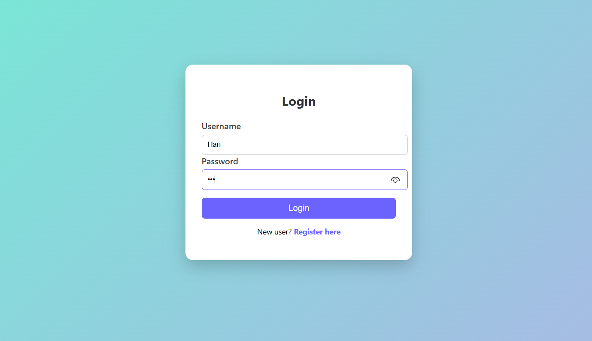
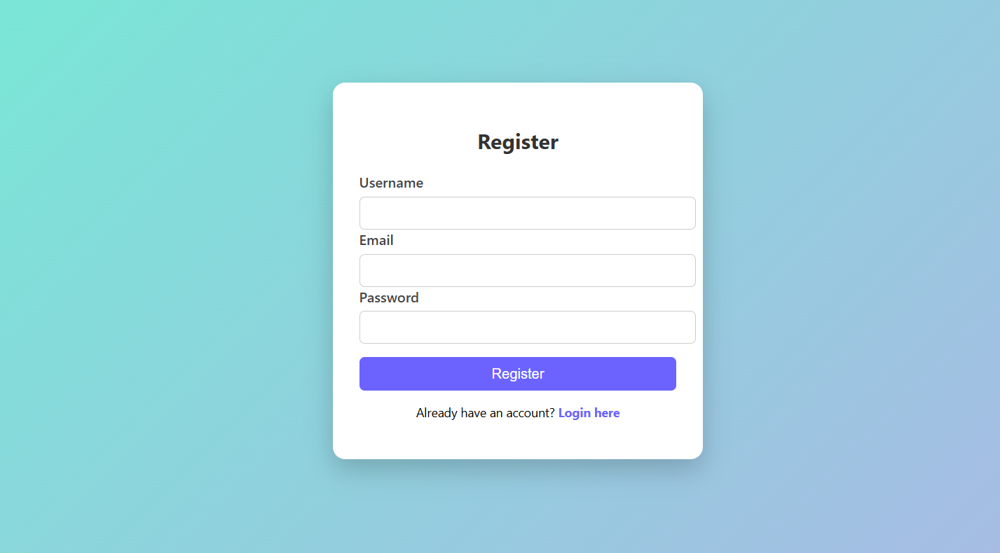
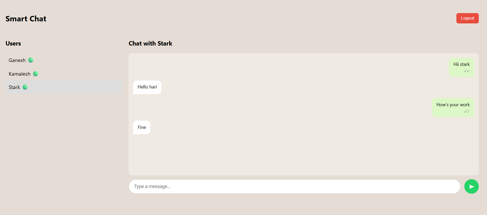

# Smart Real-Time Chat Application

A full-stack real-time chat application that enables users to communicate instantly with a clean and responsive interface.
The application supports secure user authentication and real-time messaging using WebSocket technology.

## Tech Stack

### Backend
- Java
- Spring Boot
- Spring WebSocket
- MySQL
- REST APIs

### Frontend
- React.js
- Axios
- WebSocket
- CSS

## Features

- User registration and login
- Real-time one-to-one chat
- Instant message delivery using WebSocket
- Clean and responsive user interface
- Secure backend architecture

## Application Screenshots

### Login Page

Allows users to securely log in to the chat application.

### Registration Page

New users can create an account using the registration page.

### Chat Interface

Real-time chat interface where users can send and receive messages instantly.

## How to Run the Project

### Backend Setup
1. Navigate to the `backend` folder
2. Create a `.env` file with database credentials
3. Run the Spring Boot application

### Frontend Setup
1. Navigate to the `frontend` folder
2. Install dependencies:
   npm install
3. Start the React application:
   npm start